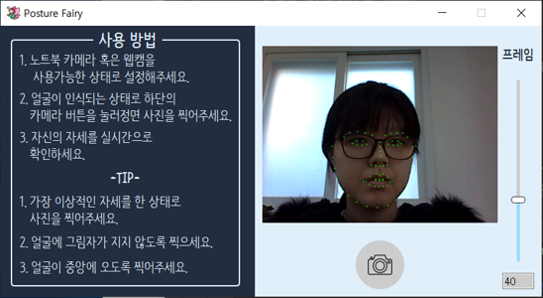
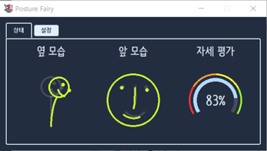

# PC 카메라를 활용한 자세교정 프로그램 (Posture Fairy)

노트북에 내장된 카메라로 자신의 자세를 실시간으로 파악하고 교정할 수 있도록 도와주는 프로그램

## 개요

+ 제작 인원: 3명 (종합 설계 프로젝트)
+ 개발 기간 : 약 7개월(2019-03\~2019-06 / 2019-09\~2019-12)
+ 사용 언어: Python

## 개발 환경

+ Pycharm

## 사용 기술

+ python
+ PYQT5, CSS (GUI)
+ OpenCV + dlib 라이브러리 (얼굴 인식 AI)

## 나의 작업

+ 프로그램 디자인 고안
+ PYQT5를 이용한 GUI 구현 및 Window 애플리케이션 제작
  + 애니메이션과 알림 창을 구현
  + 자세 수치화 및 캔버스를 활용한 그래픽화

## 동영상 링크

+ https://www.youtube.com/watch?v=_kWLah0Zdmw&feature=youtu.be

## 사용 방법

+ master/exe/main/main.exe 실행

## 미리보기

 

